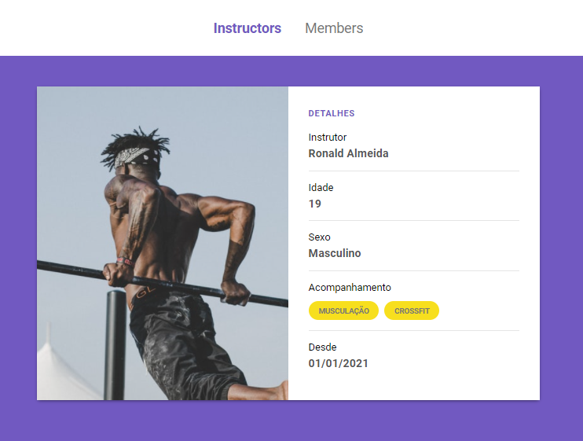

<h1 align="center">
    Gerenciador de Academia
</h1>

  <a href="#-instalar">Instalar</a>&nbsp;&nbsp;&nbsp;|&nbsp;&nbsp;&nbsp;
  <a href="#-tecnologias">Tecnologias</a>&nbsp;&nbsp;&nbsp;|&nbsp;&nbsp;&nbsp;
  <a href="#-projeto">Projeto</a>&nbsp;&nbsp;&nbsp;|&nbsp;&nbsp;&nbsp;
  <a href="#-autor">Autor</a>

 

  

<h4 align="center">
   👷🏾‍♂️⚙️ Aplicação em desenvolvimento ⚙️👷🏾‍♂️
<h4>

## 👨🏾‍💻 Instalar  

- Instale o [Visual Studio Code](https://code.visualstudio.com/)
- Baixe o [Zip do código](https://github.com/Ronald785/Launchbase-modulo04/archive/refs/heads/master.zip)
- Descompacte o arquivo e abra no VS Code
- Abra o terminal do VS Code ( ctrl + " )
- Instale as dependências do [Nodemon](https://www.npmjs.com/package/nodemon)
- Digite: npm start
- Acessa a porta [localhost:3000](http://localhost:300) do navegador 
- Voilà o projeto está rodando

## 🚀 Tecnologias

Esse projeto foi desenvolvido com as seguintes tecnologias:

- [Express](https://expressjs.com/pt-br/)
- [Nodemon](https://www.npmjs.com/package/nodemon)

## 💻 Projeto

O gerenciador de academia é um sistema para cadastramento de instrutores.

## ✍🏾 Autor

Contate-me

---

Desenvolvido no bootcamp Launchbase da [Rocketseat](https://rocketseat.com.br/)🚀